# SonarQube-Lab


Implementación de la plataforma SonarQube en un contenedor de docker para realizar la evaluación de código de un repositorio en local.

### Requisitos

A continuacion, se detallan los requisitos necesarios para la ejecucion de SonarQube

<details><summary><b>Mostrar Requisitos</b></summary>

1. [Linux](https://ubuntu.com/download) 
2. [Docker](https://docs.docker.com/engine/install/ubuntu/)

</details>

## Procedimiento

Se puede instalar SonarQube de dos formas

<details><summary><b>Mostrar Forma 1</b></summary>

### Ventajas:
Es una forma rápida y directa de iniciar SonarQube.
Requiere menos configuración inicial.   
### Desventajas:
No permite configuraciones avanzadas fácilmente, como conectar a una base de datos externa.

```
docker run -d --name sonarqube -p 9000:9000 -v sonarqube_data:/opt/sonarqube/data sonarqube
```

</details>

<details><summary><b>Mostrar Forma 2</b></summary>

### Ventajas
Permite configurar múltiples servicios (como una base de datos PostgreSQL) y gestionar redes y volúmenes fácilmente.
Más fácil de escalar y mantener en entornos más grandes o complejos.
Permite personalizar y gestionar configuraciones avanzadas.
### Desventajas:
Requiere una configuración inicial más compleja.

```
version: '2'

services:
  sonarqube:
    image: sonarqube
    ports:
      - "9000:9000"
    networks:
      - sonarnet
    environment:
      - SONARQUBE_JDBC_URL=jdbc:postgresql://db:5432/sonar
      - SONARQUBE_JDBC_USERNAME=sonar
      - SONARQUBE_JDBC_PASSWORD=sonar
    volumes:
      - sonarqube_conf:/opt/sonarqube/conf
      - sonarqube_data:/opt/sonarqube/data
      - sonarqube_extensions:/opt/sonarqube/extensions
      - sonarqube_bundled-plugins:/opt/sonarqube/lib/bundled-plugins

  db:
    image: postgres
    networks:
      - sonarnet
    environment:
      - POSTGRES_USER=sonar
      - POSTGRES_PASSWORD=sonar
    volumes:
      - postgresql:/var/lib/postgresql
      - postgresql_data:/var/lib/postgresql/data

networks:
  sonarnet:
    driver: bridge

volumes:
  sonarqube_conf:
  sonarqube_data:
  sonarqube_extensions:
  sonarqube_bundled-plugins:
  postgresql:
  postgresql_data:

```

</details>


### Ejecucion

Se ejecuta el siguiente comando en este caso, haciendo uso del docker compose 
```
docker-compose up -d
```

<p align="center">
  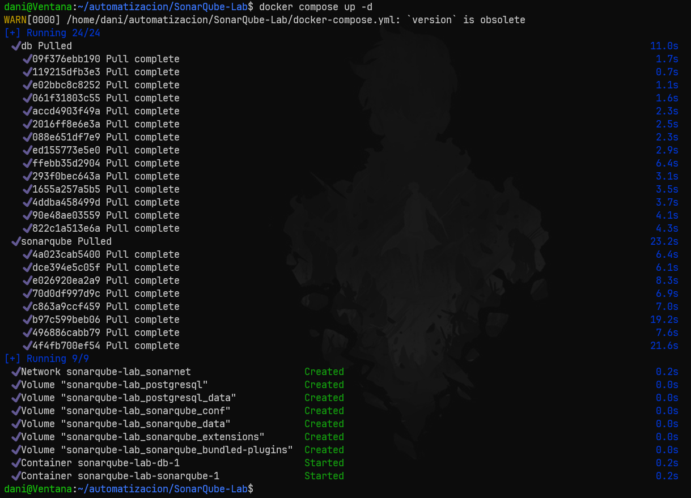
</p>


### En SonarQube

En la dir ip
```
localhost:9000
```
Encontramos la ejecucion de SonarQube

<p align="center">
  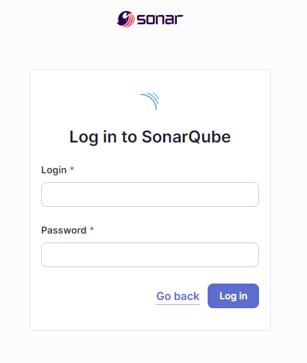
</p>

Se ingresa por defecto con

    username: admin
    password: admin

Se configura la contraseña para seguir iniciando sesion en dicha instalación de SonarQube

<p align="center">
  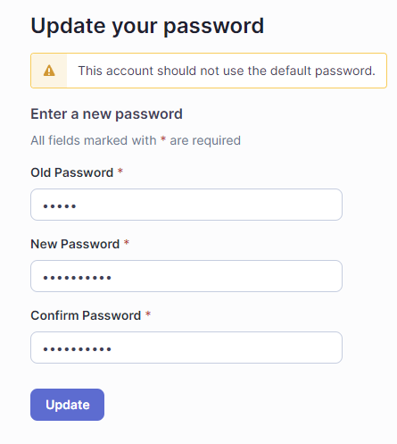
</p>

En este lab, se creara un proyecto local


<p align="center">
  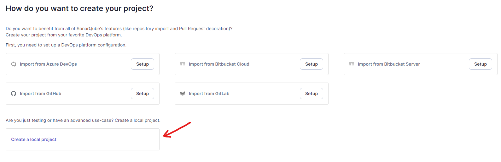
</p>

Se asigna un nombrenombre, llave y rama principal del proyecto que es la rama a analizar por sonarqube.

<p align="center">
  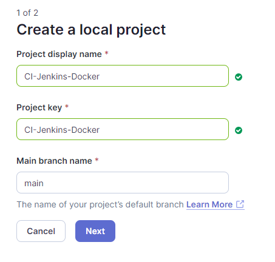
</p>

Se elige la configuracion general del proyecto

<p align="center">
  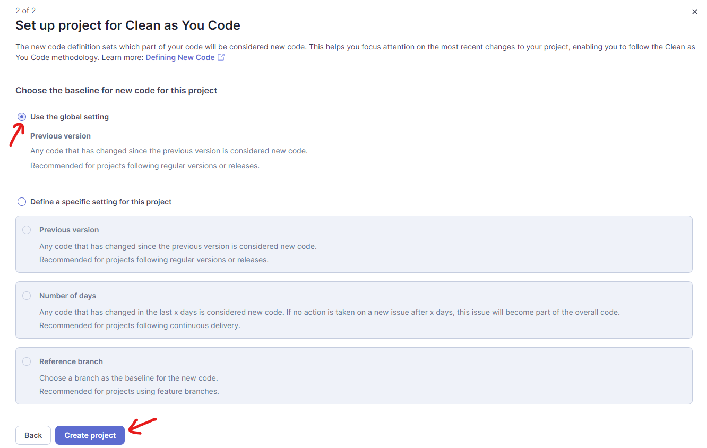
</p>

Seleccionamos la opcion de analizar el proyecto localmente

<p align="center">
  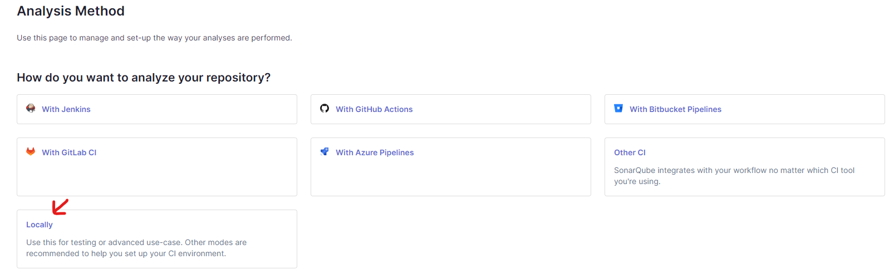
</p>

Generamos el nuevo token y seleccionamos el sistema operativo donde se esta ejecutando Sonar-Scanner o se va a instalar

<p align="center">
  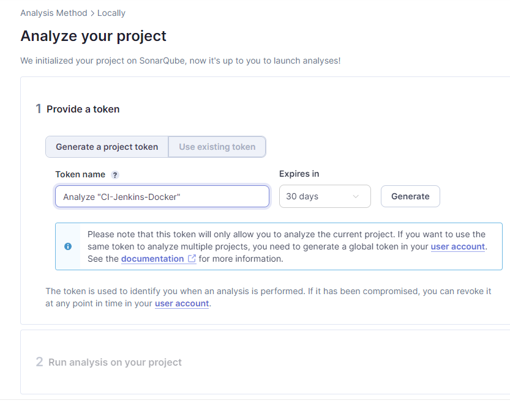
</p>

<p align="center">
  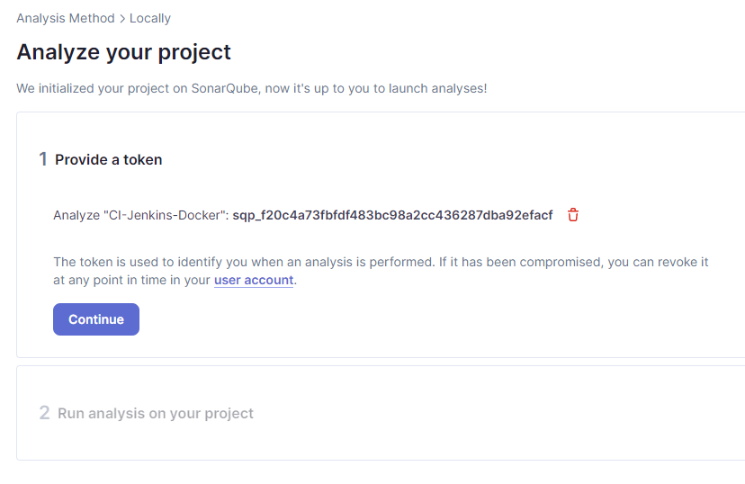
</p>

sqp_f20c4a73fbfdf483bc98a2cc436287dba92efacf

### Instalacion de Sonar-Scanner en Linux

Se debe instalar Sonar-Scanner para poder seguir con el procedimiento de Sonar-Qube

<details><summary><b>No tengo Sonar-Scanner instalado en Linux</b></summary>

Se deberan ejecutar los siguientes comandos

```
sudo apt update
sudo apt upgrade
sudo apt install wget
sudo apt install unzip
```

<p align="center">
  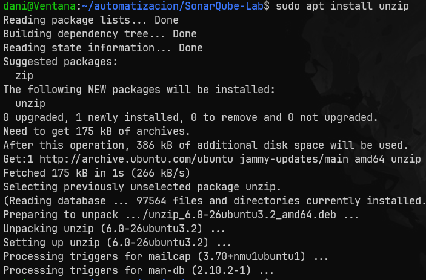
</p>

Se descarga y descomprime la ultima version de scanner usando este link

[Link de descarga ultima version](https://docs.sonarsource.com/sonarqube/latest/analyzing-source-code/scanners/sonarscanner/)

    wget https://binaries.sonarsource.com/Distribution/sonar-scanner-cli/sonar-scanner-cli-5.0.1.3006-linux.zip

<p align="center">
  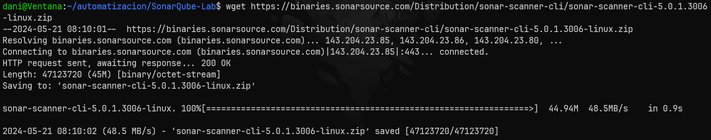
</p>

Luego se realiza el comando unzip sobre el archivo descargado

Se reubica la carpeta descargada con el comando

sudo mv <nombre-del-archivo> /opt/sonar-scanner

<p align="center">
  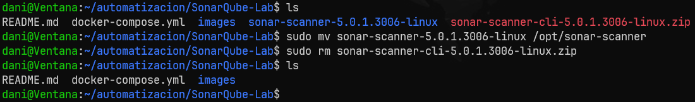
</p>


</details>

<details><summary><b>Ya tengo Sonar-Scanner instalado en Linux</b></summary>

Con sonar Scanner ya instalado se ejecutan los siguientes comandos

```
sudo ln -s /opt/sonar-scanner/bin/sonar-scanner /usr/local/bin/sonar-scanner
echo 'export PATH="/opt/sonar-scanner/bin:$PATH"' >> ~/.bashrc source ~/.bashrc
```

Ahora nos movemos a la carpeta que contiene el proyecto que queremos analizar

Y sobre dicha carpeta se ejecutan los comandos que nos fueron dados por la web page de SonarQube cuando generabamos el token

<p align="center">
  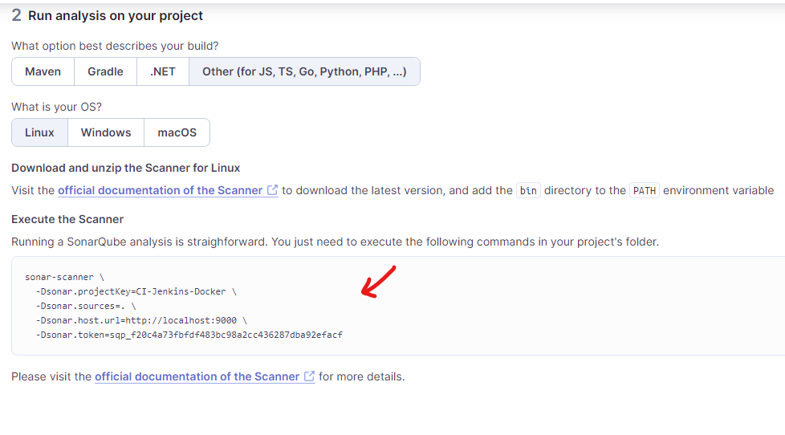
</p>

<p align="center">
  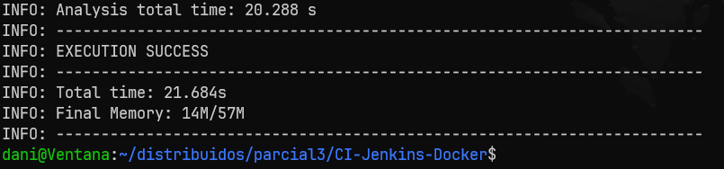
</p>

Se puede ver la alerta generada por sonar-qube

<p align="center">
  
</p>

</details>
